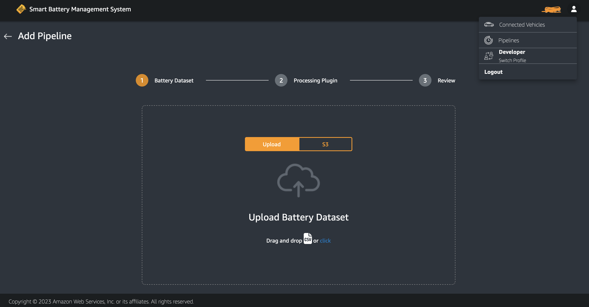
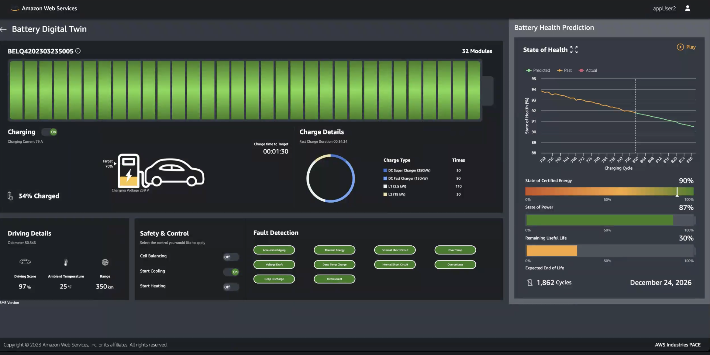
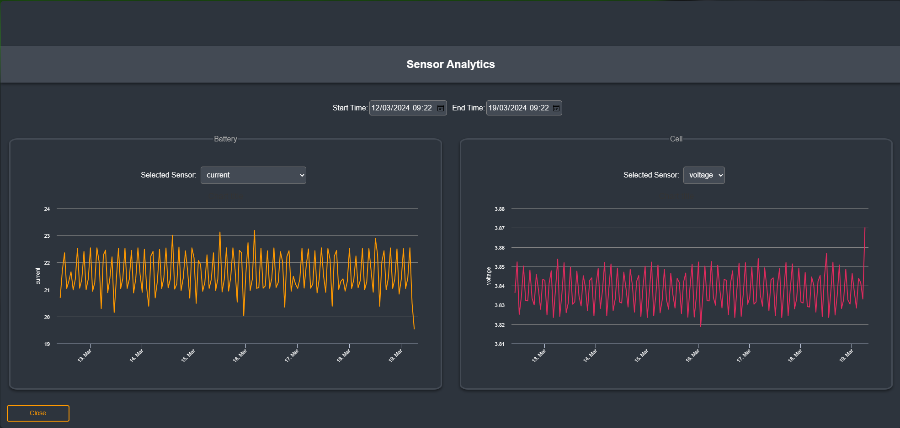

# Guidance for Battery Digital Twin on AWS

## Table of Content

1. [Overview](#overview)
    - [Cost](#cost)
2. [Prerequisites](#prerequisites)
    - [Operating System](#operating-system)
3. [Deployment Steps](#deployment-steps)
4. [Deployment Validation](#deployment-validation)
5. [Running the Guidance](#running-the-guidance)
6. [Next Steps](#next-steps)
7. [Secuirty](#security)
8. [Cleanup](#cleanup)


## Overview

EV batteries, predominately lithium-ion (Li-ion) batteries, have been the bottleneck for scaling EVs, which are crucial to a net-zero economy. One challenge in the EV battery ecosystem is insufficient and inaccurate battery state of health (SOH) and remaining useful life (RUL) monitoring and prediction, resulting in shortened battery lifespan, driver frustration, lack of visibility for end-of-life processing, and wasted critical materials. Instead of the conventional static formula-based approach, this Guidance showcases how customers can use the AI/ML capabilities on AWS to easily predict SOH and RUL. Predictions of battery health will help OEMs and EV owners proactively plan for battery replacement, and most importantly, can be used to move battery into a new life and promote the overall circular economy of a battery. Moreover, integrating fault detection algorithms into EV battery management systems in collaboration with [Eatron Technologies](https://eatron.com/), enhances overall system resilience and contributes to the seamless operation of electric vehicles, thus advancing the sustainability goals of the automotive industry.

The sample code in this project is based on the [Guidance for Electric Vehicle Battery Health Prediction on AWS](https://aws.amazon.com/solutions/guidance/electric-vehicle-battery-health-prediction-on-aws/). It deploys an event-driven ML pipeline for EV Battery health prediction using purpose-built services such as [Amazon Forecast](https://aws.amazon.com/forecast/). To simulate the data ingestion and consumption portions of the [Connected Mobility Platform](https://docs.aws.amazon.com/architecture-diagrams/latest/connected-mobility-platform-on-aws/connected-mobility-platform-on-aws.html), we build a web application, which allows you to upload battery health data and visualize battery health prediction results.


### Architecture

Here is the reference architecture for this project:


### Cost

You are responsible for the cost of the AWS services used while running this Guidance. The cost for running this Guidance with the default settings in the Default AWS Region US East-1 (N. Virginia) is approximately $181.43 per month for processing 200,000 records/month in the solution.

We recommend creating a Budget through AWS Cost Explorer to help manage costs. Prices are subject to change. For full details, refer to the pricing webpage for each AWS service used in this Guidance.

### Sample Cost Table

The following table provides a sample cost breakdown for deploying this Guidance with the default parameters in the US East (N. Virginia) Region for one month.

| AWS service  | Dimensions | Cost [USD] |
| ----------- | ------------ | ------------ |
| Amazon Timestream | 200,000 read/write events, 1024 bytes per record, 190GB Magnetic Storage | $ 71.63 |
| AWS IoT Fleetwise | 5 vehicle with 4 campaigns | $ 16.15 |
| Amazon Forecast |  83244 enteries with biweekly training | $ 48.28 |
| Amazon Cloudwatch |  5GB of log ingested per month | $ 5.5 |
| Amazon Glue |  2 ETL python jobs run for 2 minutes per pipeline execution, 15 times per month| $ 8.65 |
| Amazon S3 | 6 Buckets, 6GB storage, average object size 91.0 KB | $ 1.22 |
| others | API Gateway, VPC, WAF, GuardDuty, DynamoDB, Cloudtrail, EventBridge  | $ 30.00 |


## Prerequisites
### Operating System
These deployment instructions are optimized to best work on Amazon Linux 2 AMI.  Deployment in another OS may require additional steps.

### AWS account requirements

* [Create an AWS account](https://portal.aws.amazon.com/gp/aws/developer/registration/index.html) if you do not already have one and log in. The IAM user that you use must have sufficient permissions to make necessary AWS service calls and manage AWS resources.
* [AWS CLI](https://docs.aws.amazon.com/cli/latest/userguide/install-cliv2.html) installed and configured
* [AWS Cloud Developer Kit](https://docs.aws.amazon.com/cdk/v2/guide/cli.html) installed and configured

### Third-party tools
* [Git Installed](https://git-scm.com/book/en/v2/Getting-Started-Installing-Git)
* [Node and NPM](https://docs.npmjs.com/downloading-and-installing-node-js-and-npm) >= 14 installed
* [Docker](https://www.docker.com/)
* [Python3](https://www.python.org/downloads/) >= 3.8

### aws cdk bootstrap
This Guidance uses aws-cdk. If you are using aws-cdk for first time, please perform the step 4. in Deployment steps


## Deployment Steps

1. Create a new directory, navigate to that directory in a terminal and clone the GitHub repository:
    ```
    git clone https://github.com/aws-solutions-library-samples/guidance-for-battery-digital-twin-on-aws
    ```
2. Change directory to the pattern directory:
    ```
    cd guidance-for-battery-digital-twin-on-aws/source
    ```
3. Configure your AWS CLI to point to the AWS account and region where you want to deploy the solution. You can run the following command to verify which AWS account you are currently logged on:
    ```
    aws sts get-caller-identity
    ```
4. If you are using CDK to deploy to your AWS account for the first time, you will have to bootstrap your account. To do this, run the command:
    ```
    cdk bootstrap <account-number>/<region>
    ```
5. To build the entire project, run
    ```
    npm run build
    ```
6. To deploy the project, run
    ```
    npm run deploy
    ```

## Deployment Validation
1. We have architected this demo in a way that self-registration is disabled and only administrators can add users to access the web application. Therefore, once the project is deployed, you need to create a Cognito User to access the web application [through the AWS Management console](https://docs.aws.amazon.com/cognito/latest/developerguide/how-to-create-user-accounts.html) or [using AWS CLI](https://docs.aws.amazon.com/cli/latest/reference/cognito-idp/admin-create-user.html).

2. You have finished deployment and setting up! You can find the URL of the web application in CloudFront, or as part of the CDK outputs (value for WebAppCloudFrontDistributionDomainName eg. xxxxxxx.cloudfront.net).

**Note**: Since WAF CloudFront ACL can only be installed in us-east-1, the WAF stack and App stack might be deployed to 2 separate regions, depending on what your default deployment region is.

## Running the Guidance

The sample code deploys a web application for 2 types of users: Developer and Fleet Operator. Developer has access to all parts of the application, and Fleet Operator can only view the dashboard with battery location and digital twin of batteries after at least one ML pipeline is executed successfully. You can switch profile by clicking the User icon and then the Switch Profile button.

After logging in, Developer can upload battery health datasets as well as processing plugin scripts (scripts to clean up data). We provide sample battery datasets and sample processing plugin file for easy testing which are preloaded when the training pipeline triggers during the deployment. The sample dataset comes from a [research project](https://data.matr.io/1/projects/5c48dd2bc625d700019f3204) conducted by Severson, Attia, Jin, and others, published in the journal Nature Energy in 2019. Their study, titled "Data-driven prediction of battery cycle life before capacity degradation," appeared in Volume 4 of the journal, spanning pages 383 to 391.



After files are uploaded, the ML pipeline gets triggered to start. Developer will see the progress of the ML pipeline.


When the ML pipeline finishes (this can take a few hours), both Developer and Fleet Operator will see a map with batteries.


You can click on a vehicle to view battery information. To demonstrate how a digital twin for a battery could look like, we inserted some dummy values for the battery attributes, specifed [here](./source/deploy/assets/).



In the Battery Health Prediction panel to the right, the line chart shows past and predicted battery state of health. You can enlarge this panel and click Play to watch actual data streaming as comparison to predicted data. State of Health, RUL, and model drift were all predicted or calculated using the ML pipeline deployed with the web application.


Developer can view results from selected ML pipeline. They can click the User icon, navigate to Pipelines, select the desired pipeline, and click Connected Vehicles, which takes them to the dashboard with battery locations. For Fleet Operators, the predicted data they see are from the most recent pipeline.

There is an analytics section to examine the sensor data in detail. You can reach here by clicking the See Analytics button next to the Battery ID. In this panel you can view battery and cell level data. The data is visualized in a line chart, and you can select the time range to view.



### Fault Detection

The Fault Detection API provides real-time and historical data analysis for detecting faults in vehicles. It offers insights into various parameters such as temperature, voltage, and current, enabling users to monitor the health of their vehicles. This API is provided by Eatron Technologies, and is integrated into the web application. To access the API see the [section](#obtaining-an-api-key-for-analytics-and-fault-detection-apis) below.


##### Real-Time Anomaly Detection​

Detecting off-nominal performance in an EV is challenging, because the expected performance of a single component is dependent on the overall system operation. Rule-based anomaly detection model identifies deviations from the normal behavior based on sensor readings exceeding pre-defined thresholds. ​ Anomalous behaviors are primarily ​ caused by Over Temperature, Over Current or ​ Over Voltage. ​When the Trigger Anomaly Models switch is on, anomaly detection processes run in the background.

##### Accelerated Degradation (aging)​

Cell level abnormal aging resulting in degraded capacity with respect to the rest of the cells in the pack. It exposes the risk of overcharging as well as reduced lifespan. The model behind the scene predicts the real-time cell voltage divergence much faster than conventional rule-based methods.​

##### Lithium Plating ​Prediction

Deposition of lithium ions on the anode graphite surface is forming metallic lithium and dendritic structures. ​It cccurs mostly by the fast charging in low temperatures.​

##### Thermal Runaway Prediction​

It is a dynamic process due to a self-sustaining increase in temperature of the battery pack and occurs due to various internal and external events such as electrode degradation, electrolyte decomposition, increased internal resistance, short circuits etc. The AI model processes daily data as batch to identify likelihood of Thermal Runaway happening within the next day for a given battery back.​

### Obtaining an API Key for Analytics and Fault Detection APIs

Analytics and Fault detection services are provided by Eatron Technologies. An Eatron API Key is required for the fault detection algorithms to work, please contact [Eatron Technologies](mailto:info@eatron.com). The API key should be added to the environment variables of the web application. You can do this by updating the `EATRON_API_KEY` value in [environment.ts](source/web-app/src/environments/environment.ts)(for local) and [environment.prod.ts](source/web-app/src/environments/environment.prod.ts)(for deployment) file 

## Next Steps
The guidance provides sample battery health datasets and processing scripts. Customers can replace these with their own data sources and processing scripts specific to their domain or industry. They may need to modify the data ingestion and processing pipelines accordingly.The guidance mentions an ML pipeline for battery health prediction. Customers can customize this pipeline by incorporating their own machine learning models, algorithms, or techniques. Customers can also extend the pipeline to include additional data preprocessing, feature engineering, or model evaluation steps.


## Security

See [CONTRIBUTING](CONTRIBUTING.md#security-issue-notifications) for more information.

## Cleanup
To clean up all resources, you can run `npm run destroy`.

## License

This library is licensed under the MIT-0 License. See the LICENSE file.

## Disclaimer
You should not use this AWS Content in your production accounts, or on production or other critical data.  You are responsible for testing, securing, and optimizing the AWS Content, such as sample code, as appropriate for production grade use based on your specific quality control practices and standards.
